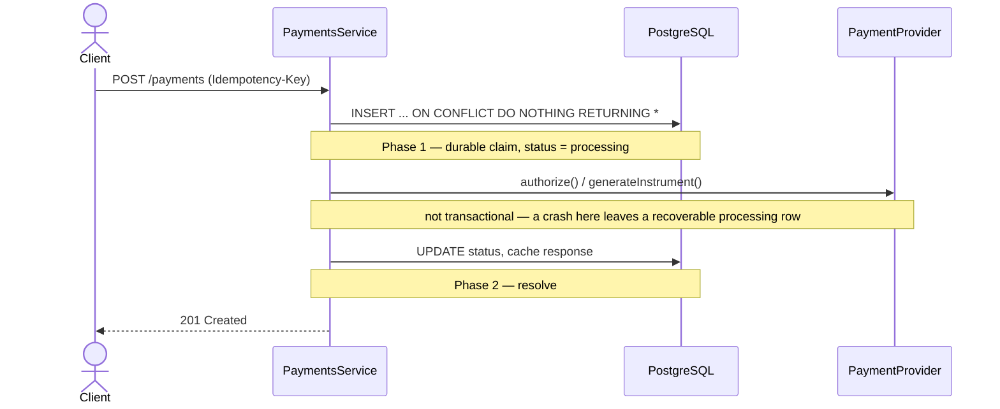

# Reliable Payments API

A reference backend exploring reliability patterns for payment APIs — idempotency, concurrency safety, and recovery from partial failure — built with NestJS, TypeORM, and PostgreSQL.

This project exists specifically as a hands-on study of idempotent system design. Payment creation was chosen as the domain deliberately: it's complexity-rich and reliability-sensitive in a way that makes distributed-systems trade-offs concrete instead of abstract.

## What this project demonstrates

### Claiming a request exactly once

- **Problem:** two requests can race to create the same payment. Over a flaky network, retries are inevitable, and a `SELECT` to check for an existing key before inserting leaves a window where both requests pass the check.
- **Considered:** check-then-insert (rejected — it recreates the exact race it's meant to prevent); catching a unique-constraint violation from a plain insert (viable, more portable across ORMs).
- **Chosen:** `INSERT ... ON CONFLICT (idempotency_key) DO NOTHING RETURNING *` — one atomic statement decides the winner, with the database as the sole authority.

### A provider call isn't transactional with the database

The hardest problem in the project. If the app tells a payment provider to charge, then crashes before recording the result, no local transaction can undo a charge that already happened elsewhere.

- **Considered:** wrapping the claim, the provider call, and the resolution in a single database transaction — rejected, because a crash mid-flight would roll back the very evidence needed to know an attempt was ever made.
- **Chosen:** a two-phase design. Phase one durably claims the request and moves the payment to `processing` _before_ calling the provider. The provider call happens outside any transaction. Phase two resolves the final status. A crash between the two phases leaves a `processing` row behind — recoverable, not lost.

### Where idempotency data lives

This decision changed mid-project, on purpose.

- **Started as:** a separate `idempotency_keys` table — a defensible, textbook-normalized design.
- **Reconsidered because:** a second table only pays for itself with a second idempotent endpoint (none exists here) or a different retention policy (not needed yet) — otherwise it's just a transaction wrapping two writes for no real benefit.
- **Chosen:** idempotency columns live directly on `payments`. The claim and the payment creation collapse into one atomic `INSERT`.

### Recovering a payment stuck mid-flight

- **Problem:** if the app dies between claiming a request and recording the provider's answer, the payment is left in `processing`.
- **Considered:** leaving it for manual intervention (doesn't scale); retrying blindly (risks a double charge).
- **Chosen:** reconciliation retries the exact same provider call using the same provider-level idempotency key the original attempt used. The safety comes from the provider's own idempotency guarantee, not from anything clever on this side — a retry either returns the original result or processes the request once, never twice.

### Swapping providers without touching business logic

- **Chosen:** a `PaymentProvider` port — an abstract class rather than a plain interface, because TypeScript interfaces disappear at compile time and NestJS's dependency injection needs a real token to resolve against. A `SimulatedPaymentProvider` adapter stands in for a real one today; adding a real provider later means writing a new adapter, not changing `PaymentsService`.

## How it fits together



Full sequence and state diagrams, including reconciliation, live in [`docs/payment-flow.md`](docs/payment-flow.md) and [`docs/reconciliation-flow.md`](docs/reconciliation-flow.md).

## Tech stack

- Node.js / TypeScript
- NestJS
- TypeORM + PostgreSQL
- class-validator / class-transformer
- Docker Compose
- Jest (unit + e2e)

## API reference

### `POST /payments`

- **Header:** `Idempotency-Key` (required)
- **Body:** `amountInCents`, `currency`, `paymentMethod` (`CREDIT_CARD` | `PIX` | `BOLETO`), `externalReference` (optional)
- **Returns:** `201` with the payment. Retrying with the same key and payload replays the original response; the same key with a different payload, or while still processing, returns `409`; a missing header or invalid body returns `400`.

### `GET /payments/:id`

- **Returns:** the payment's public fields only — `id`, `amountInCents`, `currency`, `paymentMethod`, `status`, `externalReference`. Internal idempotency bookkeeping is never exposed.
- **Errors:** `404` if not found, `400` if `id` isn't a valid UUID.

### `POST /admin/payments/reconcile`

- **Query param:** `olderThanMs` (optional, defaults to `30000`)
- **Returns:** a summary of payments found stuck in `processing`, which ones were resolved, and which are still stuck.
- **Note:** unauthenticated today — see Scope below.

## Running locally

```bash
docker compose up -d
cp .env.example .env
npm install
npm run migration:run
npm run start:dev
```

## Running tests

```bash
npm run validate       # lint, format check, typecheck, unit tests — no external dependencies
npm run test:e2e       # requires Postgres running (docker compose up -d)
npm run validate:e2e   # both, in sequence
```

Unit and e2e tests are kept as separate commands on purpose: unit tests are hermetic and safe to run on every commit, which is why they're the ones wired into the pre-commit hook. e2e tests depend on a real database, so bundling them into the same hook would block every commit on Postgres being up, regardless of what actually changed.

## Scope

The scope below is deliberate, not incomplete. Every reliability mechanism in this project — the two-phase write, the provider port, reconciliation — exists because a specific problem demanded it, not because it's common in production systems. The same standard applies going forward: nothing below gets built until an actual problem needs it, not a hypothetical one.

**Deliberately out of scope:**

- Real PSP integration — sits behind `PaymentProvider`, meant to be swapped in without touching `PaymentsService`
- Refunds, or any operation beyond creation
- The PIX/boleto settlement flow that moves a payment from `pending` to a terminal state (webhook, polling, or manual — undecided)
- Webhooks in general
- Authentication/authorization on `/admin/*` routes
- Idempotency key expiry/TTL
- Client- or account-scoped idempotency keys — there's no multi-tenant concept yet, so uniqueness is global
- A retry limit for reconciliation — a payment can currently be retried on every sweep indefinitely if a provider never resolves
- A real scheduler for reconciliation — manually triggered by design, not on a cron

**Natural next steps, if this project continues:**

- Swap `SimulatedPaymentProvider` for a real adapter (Stripe, Pagar.me, etc.) — the port shouldn't need to change
- Design the PIX/boleto settlement flow as its own document, the same way creation and reconciliation were designed before being built
- Add refunds — revisit whether `Payment` should still mean "attempt" once a business obligation can have a different kind of counter-operation against it
- Add a retry-limit/backoff policy to reconciliation, with a terminal `failed` state for payments that never resolve
- Put `/admin/*` behind authentication before this is anything more than a personal project

## License

This project is licensed under the [MIT License](LICENSE).
