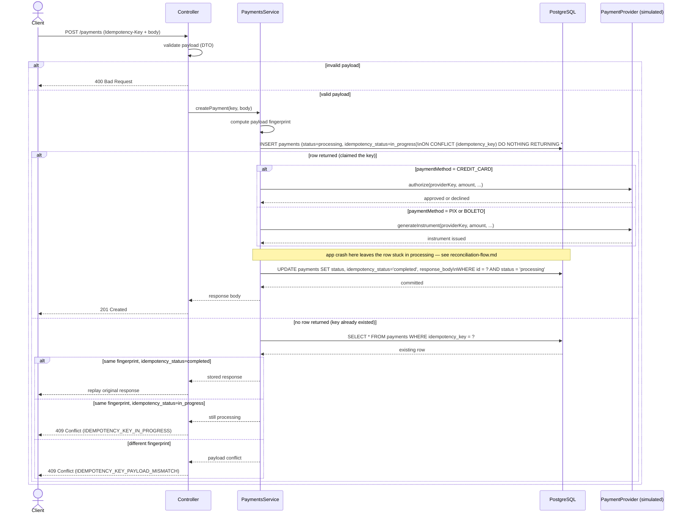
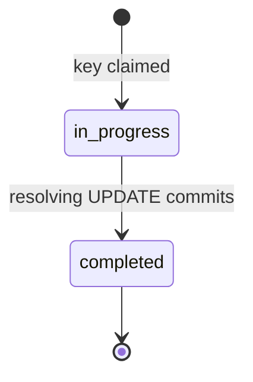

# Payment Creation Flow

> v4. Section 11 lists decisions locked in; section 12 is what's still open. This revision reflects the single-table schema — idempotency columns moved onto `payments` directly after v3 shipped, removing the separate `idempotency_keys` table and the two transactions that existed only to keep it in sync with `payments`.

## 1. Overview

This document describes the payment creation flow: how a request is validated, deduplicated via an idempotency key, handed to a (simulated) payment provider, and how the response is made safely replayable under retries, concurrent duplicates, and mid-flight crashes.

It maps to the project's core study goals: idempotency, concurrency safety, PostgreSQL constraints, and the fact that a database transaction cannot make an external provider call atomic.

## 2. Assumptions for this version

- Still no _real_ PSP integration, but the provider boundary is real and modeled, simulated behind a port.
- The client generates the `Idempotency-Key` (a UUID).
- "Payload" means the request body fields relevant to the outcome, used for the fingerprint.

## 3. Participants

- **Client** — calls the API, owns its own retry logic
- **Controller** — HTTP layer, input validation
- **PaymentsService** — orchestrates the idempotency check, the provider call, and state transitions
- **PaymentProvider** — a port (abstract class); `SimulatedPaymentProvider` stands in for a real PSP
- **PostgreSQL** — a single `payments` table carries both the business record and the idempotency bookkeeping (see section 11.8)

## 4. Domain: `Payment` is an attempt, not the obligation

`Payment` represents a single payment operation, not the underlying business obligation (an order, an invoice, a subscription charge). The obligation lives outside this project and is only referenced — via `externalReference`, a field that already existed in the entity before this question was ever asked out loud.

Consequence: one business obligation can have more than one `Payment` row. A declined `CREDIT_CARD` attempt followed by a successful `PIX` attempt for the same `externalReference` is normal, not a bug. This gets attempt-tracking without a third entity layer — two tiers is enough: an external, unowned obligation, plus `Payment`-as-attempt.

## 5. Payment methods and settlement timing

Three methods: `CREDIT_CARD`, `PIX`, `BOLETO`. All three involve a provider call at creation time:

- **`CREDIT_CARD`**: the provider call _authorizes_ the charge. Resolves to `succeeded`/`failed`.
- **`PIX`** / **`BOLETO`**: the provider call _issues a payment instrument_ (a PIX code, a boleto barcode). Resolves to `pending`, and stays there until a payer acts (settlement/confirmation flow, still out of scope — section 13).

Every method passes through `processing` while its provider call is in flight, because every method has one.

## 6. The core problem: a provider call isn't transactional with the database

```text
1. App tells the provider to charge/issue
2. Provider does it successfully
3. App crashes or times out before recording the result
4. Database has no record of what actually happened
```

A Postgres transaction can roll back a local `INSERT`. It cannot roll back something that already happened on the provider's servers. This is unavoidable — it's a gap _between two systems_, not a bug in one of them.

The standard answer isn't to prevent the gap (can't be done) but to make the system safe despite it:

1. **Never claim a terminal state before the provider confirms it.** `processing` means "committed to the call, don't know the outcome yet," and has to be a real, durably-recorded state.
2. **Make the provider call itself idempotent**, using a provider-level idempotency key — this project reuses the API's own `Idempotency-Key`, no second key scheme. A real PSP that supports this guarantees a retry after a timeout either returns the original result or processes it once — never twice.
3. **Recover stuck payments by retrying safely, not guessing.** A payment stuck in `processing` past some threshold gets its provider call retried with the same provider key.

## 7. Step-by-step flow (creation)

1. Client sends `POST /payments` with `Idempotency-Key` and a body (`amountInCents`, `currency`, `paymentMethod`, `externalReference`).
2. Controller validates the payload (DTO, global `ValidationPipe`). Invalid payloads are rejected before touching the database — they never claim the key.
3. Service computes a fingerprint of the payload (`sha256` hex digest).
4. Service atomically claims the key **and** creates the payment in one statement:
   ```sql
   INSERT INTO payments (idempotency_key, request_fingerprint, amount_in_cents, currency,
                          payment_method, external_reference, status, idempotency_status)
   VALUES ($1, $2, $3, $4, $5, $6, 'processing', 'in_progress')
   ON CONFLICT (idempotency_key) DO NOTHING
   RETURNING *;
   ```
   Because idempotency data and payment data live on the same row, this single `INSERT` is the entire claim — durable and atomic on its own, no wrapping transaction needed.
5. **Row returned** (claimed) → call the provider (`authorize` for `CREDIT_CARD`, `generateInstrument` for `PIX`/`BOLETO`), passing the provider-level idempotency key. This call is _not_ inside a DB transaction — it can't be.
6. Resolve with a single conditional `UPDATE`: sets `status`, `failure_reason`/`instrument_reference`, `idempotency_status = 'completed'`, and the cached `response_body`/`response_status`, guarded by `WHERE id = ? AND status = 'processing'`. One row, one statement — atomic on its own. Return `201 Created`.
7. **No row returned** (key already existed) → fetch the existing payment by `idempotency_key`:
   - Different fingerprint → `409 Conflict` (`IDEMPOTENCY_KEY_PAYLOAD_MISMATCH`).
   - Same fingerprint, `idempotency_status = completed` → replay the stored response.
   - Same fingerprint, `idempotency_status = in_progress` → `409 Conflict` (`IDEMPOTENCY_KEY_IN_PROGRESS`).

The gap between steps 4 and 6 — the row sitting in `processing`, provider call in flight or just finished, outcome not yet recorded — is where a crash leaves a stuck payment. Recovery: [`docs/reconciliation-flow.md`](reconciliation-flow.md).

## 8. Sequence diagram



## 9. State diagrams

### 9.1 Payment status

```mermaid
stateDiagram-v2
    [*] --> processing: claim succeeded, row created
    processing --> succeeded: CREDIT_CARD approved
    processing --> failed: CREDIT_CARD declined
    processing --> pending: PIX/BOLETO instrument issued
    pending --> succeeded: settled (future flow, out of scope)
    pending --> failed: expired or rejected (future flow; reason in failureReason)
    succeeded --> [*]
    failed --> [*]
```



Only four values. `failureReason` carries _why_ (`declined`, `expired`, `provider_timeout`) rather than the status enum growing a value per reason.

### 9.2 Idempotency status

Tracked via the `idempotency_status` column on the same `payments` row — not a separate record's lifecycle anymore, but the state machine itself is unchanged:



This can legitimately sit `in_progress` for as long as the provider call takes — that window is real, not instantaneous.

## 10. Recovery for payments stuck in `processing`

Full design, including the actual `PaymentReconciliationService`: [`docs/reconciliation-flow.md`](reconciliation-flow.md).

Short version: a sweep finds rows with `status = 'processing'` older than a threshold and retries the provider call using the same provider-level idempotency key, exactly as if the outcome were genuinely unknown — because it is. The resolving update is the same conditional pattern as the main flow:

```sql
UPDATE payments
SET status = 'succeeded', idempotency_status = 'completed'
WHERE id = ?
  AND status = 'processing';
```

If the original (slow, not dead) request and a reconciliation sweep both try to resolve the same row, only one `UPDATE` matches the `WHERE` clause. No lock, no version column — this project avoids optimistic locking until a problem actually needs it, and this doesn't.

## 11. Decisions locked in

### 11.1 `Payment` is an attempt, not an obligation (section 4)

### 11.2 Provider is simulated behind a `PaymentProvider` port

An abstract class, not a plain interface — interfaces disappear at compile time, and NestJS's DI needs a real token to resolve against.

### 11.3 Every payment method passes through `processing`

PIX/boleto instrument issuance is a provider call too (section 5).

### 11.4 Recovery is retry-via-provider-idempotency, not guesswork (section 10)

### 11.5 Concurrent request while `in_progress` → immediate `409`

`{ error: "IDEMPOTENCY_KEY_IN_PROGRESS" }`. No waiting or locking.

### 11.6 Idempotency key uniqueness is global

`UNIQUE(idempotency_key)` on `payments`, not scoped to a client — there's no client/account concept in the project.

### 11.7 State transitions use conditional `UPDATE ... WHERE status = expected`

No pessimistic lock, no `version` column.

### 11.8 Idempotency data lives on `payments`, not a separate table

Changed mid-project from an earlier two-table design. A second table only pays for itself with a second idempotent endpoint (none exists) or a different retention policy for idempotency data (not needed yet) — otherwise it's a transaction wrapping two writes for no benefit. Collapsing them let step 4 become one atomic `INSERT` instead of two statements needing an explicit transaction.

### 11.9 Atomic claim uses raw SQL, not the QueryBuilder

`INSERT ... ON CONFLICT DO NOTHING RETURNING *` via `Repository.query()`. Tested the QueryBuilder alternative (`.insert().orIgnore().returning('*')`) directly against Postgres first: on a conflict, `.raw` correctly comes back empty, but `.identifiers` and `.generatedMaps` come back as one-element arrays holding `undefined`/`{}` — checking their `.length` to detect "did this claim win" would silently treat every conflict as a win. Raw SQL with `RETURNING *` avoids that footgun entirely: one array, empty or not.

## 12. Open points still on the table

### 12.1 Retry/backoff policy for reconciliation

How many attempts before giving up and marking `failed` with a reason like `provider_unreachable`, instead of retrying on every sweep forever. Tracked in `docs/reconciliation-flow.md`.

### 12.2 Expiry policy for idempotency keys

No TTL yet. A `payments` row (and its idempotency columns) currently lives forever.

## 13. Out of scope for this iteration

- Refunds, cancellations, or any operation other than creation
- The confirmation/settlement flow that moves PIX/BOLETO from `pending` to a terminal state (webhook, polling, manual endpoint — undecided) — its own design document
- Webhooks in general
- A real PSP integration (the port makes this a later swap-in, not a redesign)
