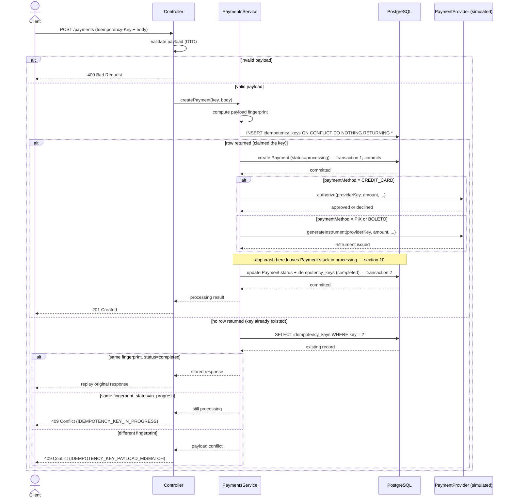
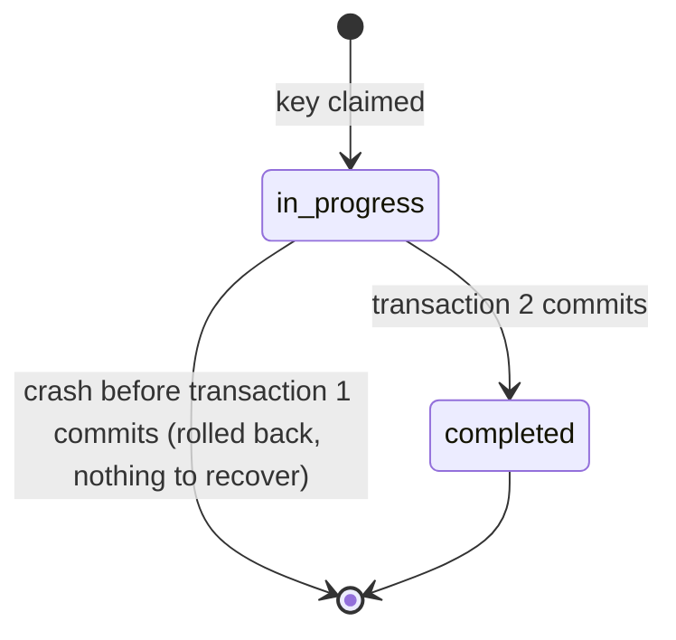

# Payment Creation Flow

> v3. Section 11 lists decisions locked in; section 12 is what's still genuinely open. This revision resolves the domain question (is `Payment` an obligation or an attempt) and stops sidestepping the provider — earlier drafts assumed no external call existed, which quietly avoided the hardest problem in the project.

## 1. Overview

This document describes the payment creation flow: how a request is validated, deduplicated via an idempotency key, handed to a (simulated) payment provider, and how the response is made safely replayable under retries, concurrent duplicates, and mid-flight crashes.

It maps to the project's core study goals: idempotency, concurrency safety, PostgreSQL constraints, and — as of this revision — the fact that a database transaction cannot make an external provider call atomic.

## 2. Assumptions for this version

- There's still no _real_ PSP integration — but the provider boundary is now real and modeled, simulated behind an interface rather than sidestepped. That's the point of this revision.
- The client generates the `Idempotency-Key` (a UUID).
- "Payload" means the request body fields relevant to the outcome, used for the fingerprint.

## 3. Participants

- **Client** — calls the API, owns its own retry logic
- **Controller** — HTTP layer, input validation
- **PaymentsService** — orchestrates the idempotency check, the provider call, and state transitions
- **PaymentProvider** — a port (interface); a simulated adapter stands in for a real PSP for now (comes with the service implementation, next step after this document)
- **Idempotency store** — `idempotency_keys` table
- **PostgreSQL**

## 4. Domain: `Payment` is an attempt, not the obligation

`Payment` represents a single payment operation, not the underlying business obligation (an order, an invoice, a subscription charge). The obligation lives outside this project and is only referenced — via `externalReference`, a field that already existed in the entity before this question was ever asked out loud. That's a good sign it was the implicit direction all along; this section just makes it explicit.

Consequence: one business obligation can have more than one `Payment` row. A declined `CREDIT_CARD` attempt followed by a successful `PIX` attempt for the same `externalReference` is normal, not a bug. This gets attempt-tracking without a third entity layer (obligation → payment → attempt) — two tiers is enough: an external, unowned obligation, plus `Payment`-as-attempt.

## 5. Payment methods and settlement timing

Three methods: `CREDIT_CARD`, `PIX`, `BOLETO`. All three now involve a provider call at creation time — not just card:

- **`CREDIT_CARD`**: the provider call _authorizes_ the charge. Resolves to `succeeded`/`failed`.
- **`PIX`** / **`BOLETO`**: the provider call _issues a payment instrument_ (a PIX code, a boleto barcode). That call can still fail or hang, same as an authorization — it's just issuing a promise to pay, not collecting money yet. Resolves to `pending`, and stays there until a payer acts (settlement/confirmation flow, still out of scope — section 13).

This unifies something that used to be modeled inconsistently: every method passes through `processing` while its provider call is in flight, because every method has one.

## 6. The core problem: a provider call isn't transactional with the database

This is the piece earlier drafts avoided by assuming no external call existed.

```text
1. App tells the provider to charge/issue
2. Provider does it successfully
3. App crashes or times out before recording the result
4. Database has no record of what actually happened
```

A Postgres transaction can roll back a local `INSERT`. It cannot roll back something that already happened on the provider's servers. This is unavoidable — no amount of careful local transaction design closes that gap, because it's a gap _between two systems_, not a bug in one of them.

The standard answer isn't to prevent the gap (can't be done) but to make the system safe despite it:

1. **Never claim a terminal state before the provider confirms it.** `processing` exists specifically to mean "committed to the call, don't know the outcome yet." This is why it has to be a real, durably-recorded state and not something skipped over.
2. **Make the provider call itself idempotent**, using a provider-level idempotency key (can reuse the API's own `Idempotency-Key` for this project — no need for a second key scheme). A real PSP that supports this (Stripe, and Brazilian PIX/boleto providers, do) guarantees that retrying the same call after a timeout either returns the original result or processes it once — never twice.
3. **Recover stuck payments by retrying safely, not guessing.** A payment stuck in `processing` past some threshold gets its provider call retried with the same provider key. Safe, because of point 2.

## 7. Step-by-step flow (creation)

1. Client sends `POST /payments` with `Idempotency-Key` and a body (`amountInCents`, `currency`, `paymentMethod`, `externalReference`).
2. Controller validates the payload (DTO). Invalid payloads are rejected before touching the idempotency store — they never claim the key.
3. Service computes a fingerprint of the payload.
4. Service atomically claims the key: `INSERT ... ON CONFLICT (key) DO NOTHING RETURNING *` against `idempotency_keys`, `status = in_progress`.
5. **Claim succeeds** → **transaction 1**: create `Payment` with `status = processing`. Commit. This is durable — if the app dies one line later, there's a real record that this attempt started.
6. Call the provider (`authorize` for `CREDIT_CARD`, `generateInstrument` for `PIX`/`BOLETO`), passing the provider-level idempotency key. This call is _not_ inside a DB transaction — it can't be.
7. **Transaction 2**: update `Payment.status` (`succeeded`/`failed` for card, `pending` for PIX/boleto) and mark the idempotency record `completed` with the response. Commit. Return `201 Created`.
8. **Claim is a no-op** (key already existed) → fetch the existing record:
   - Same fingerprint, `completed` → replay the stored response.
   - Same fingerprint, `in_progress` → `409 Conflict` (`IDEMPOTENCY_KEY_IN_PROGRESS`).
   - Different fingerprint → `409 Conflict` (`IDEMPOTENCY_KEY_PAYLOAD_MISMATCH`).

The gap between steps 5 and 7 — Payment sitting in `processing`, provider call in flight or just finished, outcome not yet recorded — is where a crash leaves a stuck payment. Section 10 covers recovery.

## 8. Sequence diagram



## 9. State diagrams

### 9.1 Payment status

```mermaid
stateDiagram-v2
    [*] --> processing: claim succeeded, Payment created
    processing --> succeeded: CREDIT_CARD approved
    processing --> failed: CREDIT_CARD declined
    processing --> pending: PIX/BOLETO instrument issued
    pending --> succeeded: settled (future flow, out of scope)
    pending --> failed: expired or rejected (future flow; reason in failureReason)
    succeeded --> [*]
    failed --> [*]
```



Only four values. `failureReason` (already on the entity) carries _why_ — `declined`, `expired`, `provider_timeout` — rather than the status enum growing a value per reason.

### 9.2 Idempotency record



Note this record can legitimately sit `in_progress` for as long as the provider call takes — that window is now real, not instantaneous.

## 10. Recovery for payments stuck in `processing`

A sweep (triggered however — scheduled job or a manual endpoint, left open, section 12) finds `Payment` rows with `status = processing` older than some threshold, and for each: retries the provider call using the same provider-level idempotency key it would have used originally, exactly as if the first call's outcome were genuinely unknown (because it is). The provider's own idempotency guarantee makes this safe — it returns the real outcome whether or not the original call actually went through.

State transitions during this update use a conditional `UPDATE`, not a lock:

```sql
UPDATE payments
SET status = 'succeeded'
WHERE id = ?
  AND status = 'processing';
```

If the sweep and, say, a webhook (future work) both race to resolve the same payment, only one `UPDATE` matches the `WHERE` clause and takes effect — no `SELECT ... FOR UPDATE`, no version column. This project explicitly avoids introducing optimistic locking until a problem actually needs it, and this doesn't.

## 11. Decisions locked in

### 11.1 `Payment` is an attempt, not an obligation (section 4)

### 11.2 Provider is simulated behind a `PaymentProvider` port

Real implementation swapped in later without touching `PaymentsService`. Built alongside the service logic, next.

### 11.3 Every payment method passes through `processing`

Not just card — PIX/boleto instrument issuance is a provider call too (section 5).

### 11.4 Recovery is retry-via-provider-idempotency, not guesswork (section 10)

### 11.5 Concurrent request while `in_progress` → immediate `409`

`{ error: "IDEMPOTENCY_KEY_IN_PROGRESS" }`. No waiting or locking.

### 11.6 Idempotency key uniqueness is global

`UNIQUE(key)`, not scoped to a client — there's no client/account concept in the project yet.

### 11.7 State transitions use conditional `UPDATE ... WHERE status = expected`

No pessimistic lock, no `version` column (section 10).

## 12. Open points still on the table

### 12.1 Reconciliation trigger mechanism

Scheduled job vs. manual/admin endpoint vs. checked lazily on read. Doesn't affect the safety guarantee, only how promptly stuck payments get resolved.

### 12.2 Retry/backoff policy for reconciliation

How many attempts before giving up and marking `failed` with `failureReason = 'provider_unreachable'` (or similar) instead of retrying forever.

### 12.3 Expiry policy for idempotency keys

TTL, and whether enforced by a cleanup job or at read time.

### 12.4 Exact mechanism for the atomic claim

`INSERT ... ON CONFLICT DO NOTHING` vs. catching a unique-constraint violation — same observable behavior either way.

## 13. Out of scope for this iteration

- Refunds, cancellations, or any operation other than creation
- The confirmation/settlement flow that moves PIX/BOLETO from `pending` to a terminal state (webhook, polling, manual endpoint — undecided) — its own design document
- Webhooks in general
- A real PSP integration (the port makes this a later swap-in, not a redesign)
