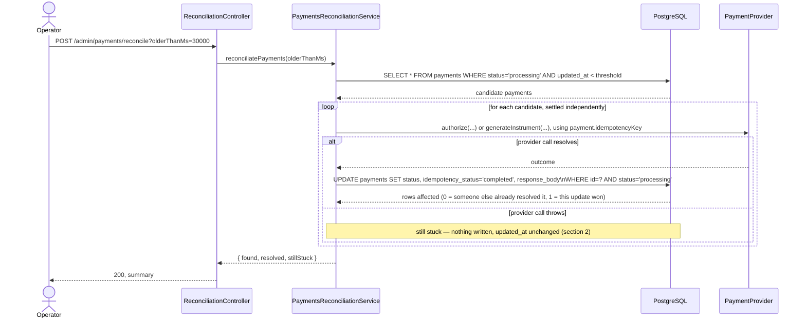

# Payment Reconciliation Flow

> v2. Reflects the actual built `PaymentsReconciliationService`, updated after `payment-flow.md` moved idempotency onto `payments` directly — the version this document originally shipped against still assumed a separate `idempotency_keys` table.

## 1. Overview

A `Payment` gets stuck in `processing` when the app claims the idempotency key, then dies or loses the provider's response before the resolving update runs — the exact gap `payment-flow.md` section 6 exists to name. Reconciliation finds those payments and retries the provider call using the same provider-level idempotency key the original attempt used, safe precisely because that key is idempotent on the provider's side.

## 2. What counts as "stuck"

A candidate is `status = 'processing'` and hasn't been touched in at least `olderThanMs`:

```sql
SELECT * FROM payments WHERE status = 'processing' AND updated_at < :threshold
```

`olderThanMs` is a parameter to `reconciliatePayments`, not a constant — a test calls it with `0` and any `processing` row already counts as stuck.

**Known gap, not yet fixed:** the original design called for a failed retry to still bump `updated_at`, so a payment that keeps failing gets picked up again next sweep instead of being hammered every time. As built, a failed attempt (`resolvePaymentOutcome` throwing) never reaches `finalizePaymentOutcome`, so nothing is written and `updated_at` doesn't move — a permanently failing provider means that payment is retried on every single sweep, with no backoff. Folded into the open retry/backoff question (section 6) rather than fixed ad hoc, since a real fix means deciding the retry-limit policy at the same time, not patching the symptom alone.

## 3. Participants

- **Operator** — triggers the sweep manually
- **PaymentsReconciliationController** — `POST admin/payments/reconcile`, optional `olderThanMs` query param (default `30000`)
- **PaymentsReconciliationService** — the sweep
- **`resolvePaymentOutcome` / `finalizePaymentOutcome`** — shared with `PaymentsService`, not reconciliation-specific (section 5)
- **PaymentProvider** — same port, same `SimulatedPaymentProvider`
- **PostgreSQL**

## 4. Step-by-step flow

1. Find every `Payment` matching section 2's query (`Repository.find`, not raw SQL — this is a plain read, no atomicity concerns).
2. For each candidate, independently, via `Promise.allSettled` (one payment failing doesn't abort the sweep for the rest):
   - Call `resolvePaymentOutcome` — the same function `PaymentsService.createPayment` uses, branching `authorize()` (`CREDIT_CARD`) vs `generateInstrument()` (`PIX`/`BOLETO`), passing `payment.idempotencyKey` as the provider-level key.
   - **Resolves successfully** → `finalizePaymentOutcome` runs the same conditional update the main flow uses (`WHERE id = ? AND status = 'processing'`). If another writer already resolved this row first, the update matches zero rows — not an error, just a no-op, indistinguishable from success in this flow (see section 6 for the current limit of that).
   - **Throws again** → left as `processing`, nothing written (section 2's known gap), recorded in this sweep's summary.
3. Build the response from the settled results, matched back to `stuckPayments` by array index (`Promise.allSettled` preserves order):
   - Fulfilled → `resolved: { paymentId, status }`
   - Rejected → `stillStuck: { paymentId, error }`, where `error` is `reason.message` if `reason instanceof Error`, else `String(reason)`
4. Return `{ found, resolved, stillStuck }` — `found` is `resolved.length + stillStuck.length`.

## 5. Reused, not reimplemented

`resolvePaymentOutcome` and `finalizePaymentOutcome` (`src/payments/shared/`) are the same functions the creation flow uses — this document originally called for extracting them "when reconciliation needs the same logic a second time," and that's exactly what happened. Both take their dependencies as plain parameters (a `PaymentProvider`, a `Repository<Payment>`) rather than being injected NestJS services themselves, which is what makes sharing them between two different services straightforward.

The response-shaping (`toPaymentResponseBody`, in `shared/payment-response.ts`) is also shared — the same picked fields (`id`, `amountInCents`, `currency`, `paymentMethod`, `status`, `externalReference`) get cached into `response_body` here as in the main flow, so a client retrying the original request after reconciliation fixed it gets an identical replay.

## 6. Decisions locked in

- Threshold checked against `updated_at`, via `Repository.find` — no raw SQL needed for a plain read.
- Retry uses the payment's own `idempotency_key` as the provider-level key — no separate key scheme.
- Conditional `UPDATE ... WHERE status = 'processing'` is the only concurrency guard — no locking, no transaction (the whole point of collapsing to one table — see `payment-flow.md` 11.8).
- `Promise.allSettled`, not `Promise.all` — one payment's provider failure must not abort the sweep for the rest. (This was a real bug caught in review: an earlier draft used `Promise.all`, which does abort on the first rejection.)
- Provider-branching and response-shaping logic are shared with the creation flow, not duplicated (section 5).

## 7. Sequence diagram



## 8. Open points

- **Retry limit / permanent-failure policy.** A payment can be retried on every sweep forever if the provider never resolves — now confirmed to include no backoff at all (section 2). At some point this should become a terminal `failed` with a reason like `provider_unreachable`, needs a cutoff (attempt count, or absolute age) — not designed yet.
- **`olderThanMs` default.** `30000` (30s) shipped as the controller's default; not a considered choice, just what came up in conversation.
- **Auth on `/admin/*`.** The reconciliation endpoint is unauthenticated. Tracked in the project README's scope section, not solved here.

## 9. Out of scope

- A real scheduler — this stays manually triggered
- Alerting when `stillStuck` is non-zero
